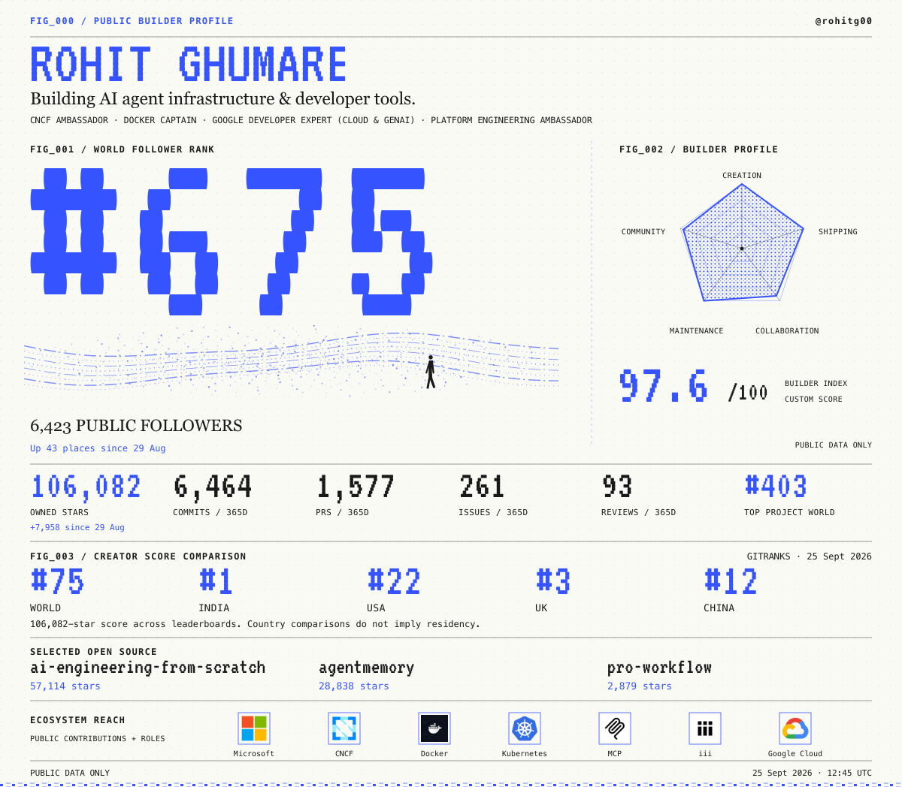

<picture>
  <source media="(max-width: 600px)" srcset="./assets/public-builder-rank-mobile.png" />
  
</picture>

[Website](https://rohitghumare.com) · [Blog](https://rohitghumare.com/blog) · [LinkedIn](https://www.linkedin.com/in/rohit-ghumare/) · [X](https://twitter.com/ghumare64) · [Sponsor](https://github.com/sponsors/rohitg00)

[AI Engineering from Scratch](https://github.com/rohitg00/ai-engineering-from-scratch) · [agentmemory](https://github.com/rohitg00/agentmemory) · [pro-workflow](https://github.com/rohitg00/pro-workflow)

Public statistics refresh automatically. <a href="./RANKING.md">Sources and methodology</a>.
