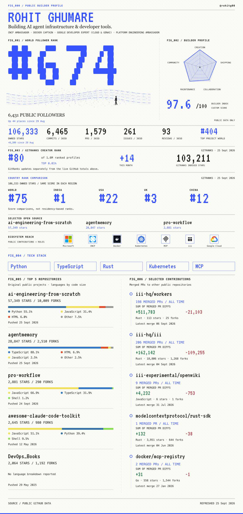
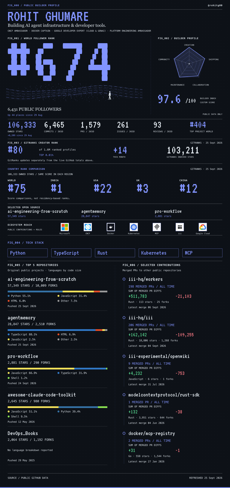

<a href="./assets/public-builder-profile.png#gh-light-mode-only">
<picture>
  <source media="(max-width: 600px)" srcset="./assets/public-builder-profile-mobile.png" />
  
</picture>
</a>
<a href="./assets/public-builder-profile-dark.png#gh-dark-mode-only">
<picture>
  <source media="(max-width: 600px)" srcset="./assets/public-builder-profile-mobile-dark.png" />
  
</picture>
</a>

[Blog](https://rohitghumare.com/blog) · [LinkedIn](https://www.linkedin.com/in/rohit-ghumare/) · [X](https://twitter.com/ghumare64) · [Sponsor](https://github.com/sponsors/rohitg00)

[All repositories](https://github.com/rohitg00?tab=repositories) · [All merged contributions](https://github.com/search?q=author%3Arohitg00+is%3Apr+is%3Amerged+is%3Apublic+-user%3Arohitg00&type=pullrequests)

Public statistics refresh automatically. <a href="./RANKING.md">Sources and methodology</a>.
